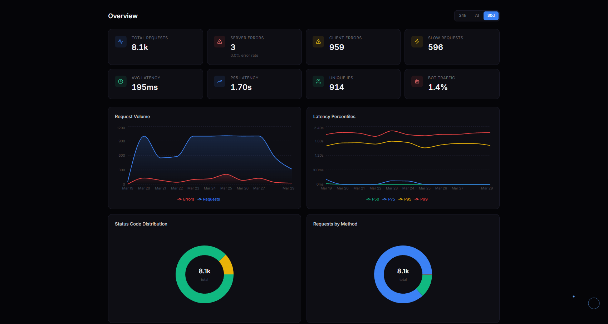
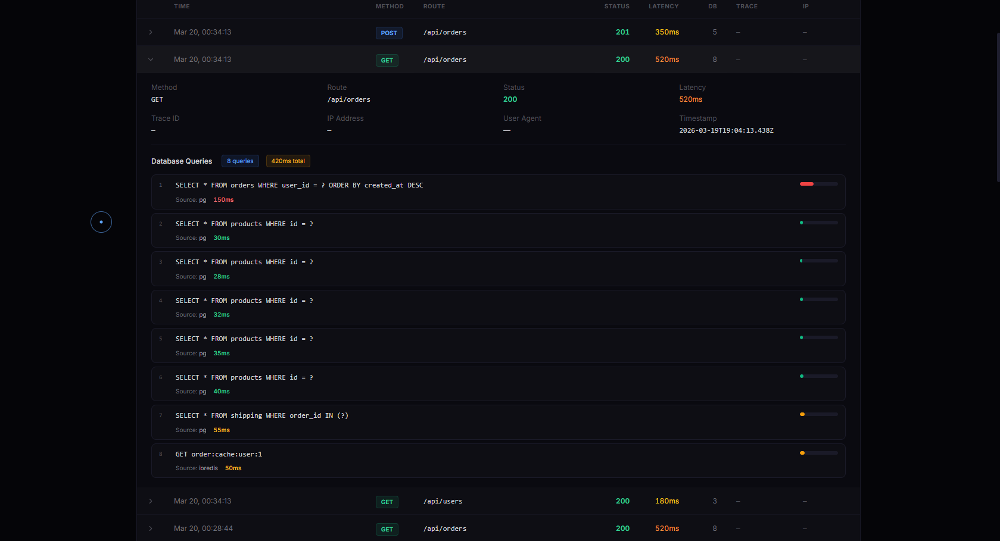
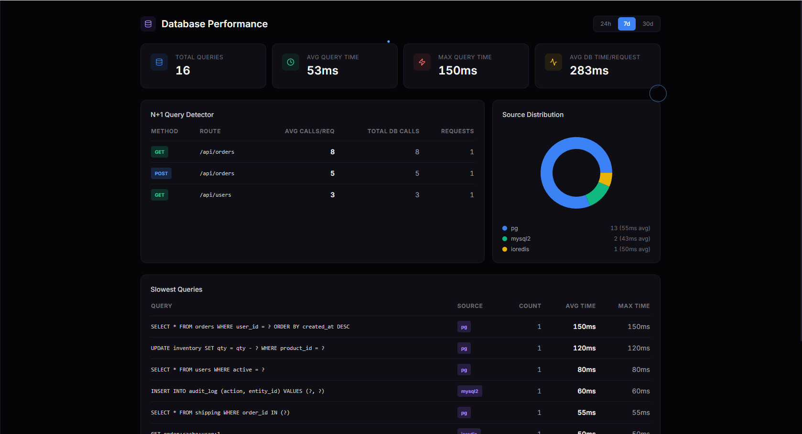
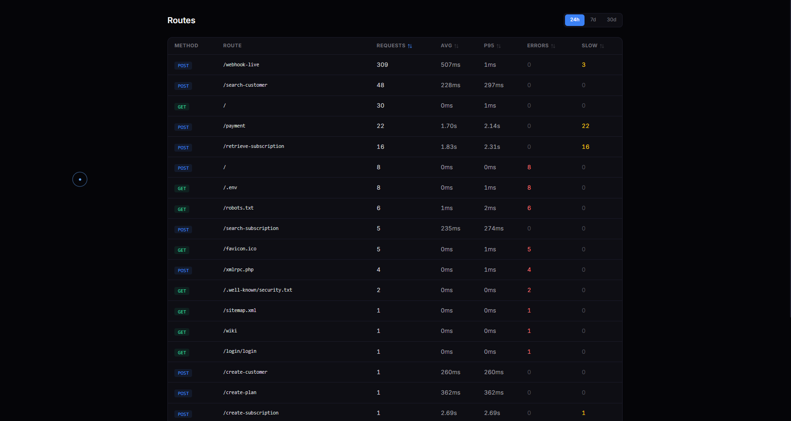

<h1 align="center">auto-api-observe</h1>

<p align="center">
  <strong>API observability for Express & Fastify in 1 line of code.</strong><br/>
  Zero config. Zero dependencies. Auto DB instrumentation. Cloud dashboard included.
</p>

<p align="center">
  <a href="https://www.npmjs.com/package/auto-api-observe"></a>
  <a href="https://www.npmjs.com/package/auto-api-observe"></a>
  <a href="https://github.com/rahhuul/auto-api-observe"></a>
  <a href="https://github.com/rahhuul/auto-api-observe/blob/master/LICENSE"></a>
  <a href="https://apilens.rest"></a>
  <a href="https://github.com/rahhuul/auto-api-observe/blob/master/CHANGELOG.md"></a>
</p>

---

## The Problem

You ship an Express/Fastify API. Then you need to know: which routes are slow? What's your error rate? How many DB queries per request? Is that new endpoint even being used?

Datadog costs $23/host/month. New Relic wants your credit card. Grafana takes an afternoon to configure.

## The Solution

```js
app.use(require('auto-api-observe')());  // done.
```

Every request is now tracked with structured JSON logs, trace IDs, latency, auto DB profiling, and slow request detection.

**Want a dashboard?** Add your API key and see everything at [apilens.rest](https://apilens.rest):

```js
app.use(require('auto-api-observe')({ apiKey: 'sk_...' }));
```

---

## Why auto-api-observe?

| Feature | **auto-api-observe** | Datadog | New Relic | Sentry |
|---|:---:|:---:|:---:|:---:|
| Setup time | **10 seconds** | 30+ min | 30+ min | 15+ min |
| Lines of code | **1** | 20+ | 15+ | 10+ |
| Dependencies | **0** | 50+ | 40+ | 30+ |
| Free tier | **Free during beta** | 14-day trial | 100GB/mo | 5k events |
| Auto DB tracking | **8 libraries** | Custom setup | Custom setup | No |
| Config required | **None** | Agent + YAML | Agent + config | DSN + config |

---

## Install

```bash
npm install auto-api-observe
```

---

## Quick Start

### Express

```js
const express = require('express');
const observe = require('auto-api-observe');

const app = express();
app.use(observe());

app.get('/users', (req, res) => res.json({ users: [] }));
app.listen(3000);
```

### Fastify

```js
const fastify = require('fastify')();
const { fastifyObservability } = require('auto-api-observe');

await fastify.register(fastifyObservability);

fastify.get('/users', async () => ({ users: [] }));
await fastify.listen({ port: 3000 });
```

### With Cloud Dashboard

```js
app.use(observe({
  apiKey: 'sk_...',  // get one free at apilens.rest
}));
```

---

## What You Get

Every request automatically outputs:

```json
{
  "timestamp": "2026-03-20T12:00:00.000Z",
  "traceId": "a1b2c3d4-e5f6-7890-abcd-ef1234567890",
  "method": "GET",
  "route": "/api/users",
  "path": "/api/users",
  "status": 200,
  "latency": 85,
  "latencyMs": "85ms",
  "dbCalls": {
    "calls": 2,
    "totalTime": 45,
    "slowestQuery": 30,
    "queries": [
      { "query": "SELECT * FROM users WHERE active = ?", "source": "pg", "queryTime": 30 },
      { "query": "SELECT COUNT(*) FROM sessions WHERE user_id = ?", "source": "pg", "queryTime": 15 }
    ]
  },
  "slow": false,
  "ip": "127.0.0.1"
}
```

---

## Auto DB Instrumentation (v1.2.0)

No code changes needed. The middleware automatically patches these libraries at startup:

- **pg** (node-postgres)
- **mysql2**
- **mongoose** (MongoDB)
- **@prisma/client**
- **knex**
- **sequelize**
- **ioredis** (Redis)
- **better-sqlite3**

For each query you get:
- Masked SQL string (values replaced with `?` for security)
- Execution time in milliseconds
- Source library name
- Per-request aggregates (total calls, total time, slowest query)

```js
// No changes needed — just use your DB libraries as normal
app.get('/orders', async (req, res) => {
  const orders = await db.query('SELECT * FROM orders WHERE user_id = $1', [req.user.id]);
  const products = await db.query('SELECT * FROM products WHERE id = ANY($1)', [orders.map(o => o.product_id)]);
  res.json({ orders, products });
});
// Log will automatically show: dbCalls: { calls: 2, totalTime: 45, queries: [...] }
```

Disable auto-instrumentation if needed:

```js
app.use(observe({ autoInstrument: false }));
```

---

## Cloud Dashboard

Sign up free at [apilens.rest](https://apilens.rest) and add your API key:

```js
app.use(observe({ apiKey: process.env.APILENS_KEY }));
```

**What you see in the dashboard:**

- **Overview** — total requests, error rate, P95 latency, 6 interactive charts
- **All Requests** — every request with full details, DB queries, filters, search
- **Routes** — per-route breakdown (calls, avg latency, P95, errors, slow count)
- **Errors** — paginated 4xx/5xx log with error timeline and top error routes
- **Slow Requests** — latency distribution histogram
- **Database** — query profiling, N+1 detection, slow queries, source distribution
- **Traces** — distributed trace waterfall visualization
- **Live Tail** — real-time SSE stream with method/status/route filters
- **Usage** — daily quota tracking
- **Alerts** — email or Slack when error rate or latency spikes
- **Team** — invite collaborators to your project

> **Free during beta** — all features included, no credit card.

### Screenshots

**Overview** — real-time KPIs, request volume, latency percentiles, status distribution



**Request Log** — every request with full DB query details, trace IDs, filters



**Database Profiling** — N+1 detection, slow queries, source distribution



**Routes** — per-route breakdown with latency, errors, slow count



---

## Features

- **Structured JSON logs** — every response emits a clean JSON entry
- **Distributed trace IDs** — auto-generated UUID, forwarded via `x-trace-id`
- **Auto DB profiling** — patches 8 DB libraries, per-query timing and masked SQL
- **Slow request detection** — configurable threshold (default 1000ms)
- **In-memory metrics** — aggregated per-route stats via `getMetrics()`
- **Custom fields** — attach arbitrary data with `addField()`
- **Cloud dashboard** — charts, errors, traces, alerts at apilens.rest
- **Data retention** — auto-cleanup by plan (free 7d, starter 30d, pro 90d)
- **High throughput** — buffered async logger, 600k+ req/min
- **Sampling** — `sampleRate` for extreme volume
- **Memory safe** — `maxRoutes` cap prevents unbounded growth
- **TypeScript-first** — full type definitions
- **Zero dependencies** — pure Node.js

---

## Custom Fields

```js
const { addField } = require('auto-api-observe');

app.get('/orders', async (req, res) => {
  addField('userId', req.user.id);
  addField('orderCount', orders.length);
  res.json(orders);
});
```

---

## Manual DB Tracking

If you prefer manual tracking over auto-instrumentation:

```js
const { trackDbCall, recordDbQuery } = require('auto-api-observe');

// Simple counter
trackDbCall();

// Rich tracking
recordDbQuery({
  query: 'SELECT * FROM users WHERE id = ?',
  source: 'pg',
  queryTime: 12,
});
```

---

## Metrics Endpoint

```js
const { getMetrics } = require('auto-api-observe');

app.get('/metrics', (req, res) => res.json(getMetrics()));
```

Returns per-route aggregates: count, avg/min/max latency, errors, slow count, status codes.

---

## Distributed Tracing

Trace IDs propagate automatically across services:

```
Service A (generates traceId abc-123)
  → Service B (reads x-trace-id, reuses abc-123)
    → Service C (same ID — full chain visible in logs)
```

Access in your handler: `req.traceId`

---

## All Options

```ts
observe({
  // Local
  slowThreshold: 1000,        // ms — flag requests above this
  logger: console.log,        // custom log fn, or `false` to silence
  enableMetrics: true,        // collect in-memory metrics
  skipRoutes: ['/health'],    // skip routes (string prefix or RegExp)
  traceHeader: 'x-trace-id', // header for trace ID propagation
  maxRoutes: 1000,            // cap on distinct routes in metrics
  sampleRate: 1.0,            // 0.0–1.0, fraction to log
  autoInstrument: true,       // auto-patch DB libraries
  onRequest: (ctx) => {},     // called at start of each request
  onResponse: (entry) => {},  // called after each response

  // Cloud dashboard (apilens.rest)
  apiKey: 'sk_...',           // enables remote shipping
  endpoint: 'https://...',    // override for self-hosted
  flushInterval: 5000,        // ms between batch flushes
  flushSize: 100,             // flush when queue hits this size
});
```

---

## TypeScript

```ts
import observe, {
  ObservabilityOptions,
  LogEntry,
  DbCalls,
  DbQuery,
  Metrics,
  trackDbCall,
  recordDbQuery,
  addField,
  getMetrics,
  autoInstrument,
} from 'auto-api-observe';
```

---

## Contributing

Contributions welcome! Please open an issue first to discuss.

```bash
git clone https://github.com/rahhuul/auto-api-observe.git
cd auto-api-observe
npm install
npm test      # 44 tests
```

---

## License

MIT

---

<p align="center">
  Built by <a href="https://github.com/rahhuul">@rahhuul</a> ·
  <a href="https://x.com/rahhuul310">Twitter</a> ·
  <a href="https://apilens.rest">apilens.rest</a> ·
  <a href="https://github.com/rahhuul/auto-api-observe">GitHub</a> ·
  <a href="https://www.npmjs.com/package/auto-api-observe">npm</a> ·
  <a href="https://github.com/rahhuul/auto-api-observe/blob/master/CHANGELOG.md">Changelog</a>
</p>
